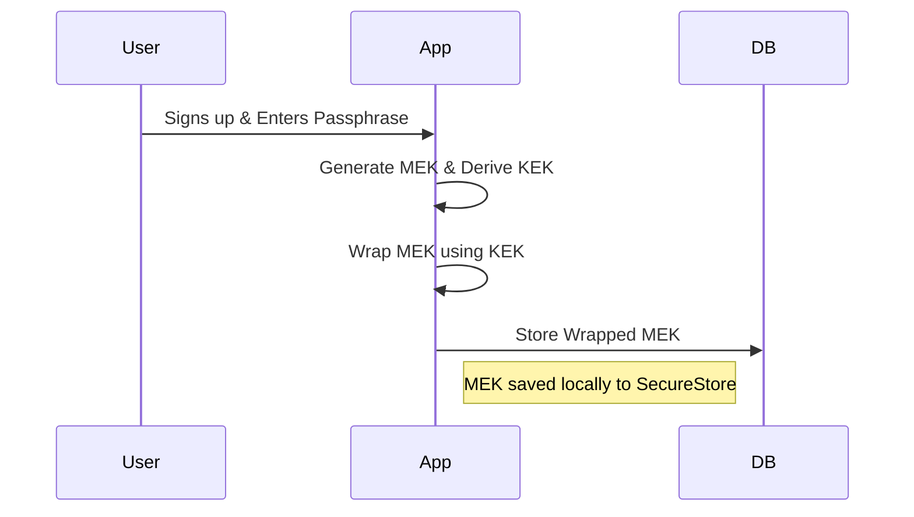
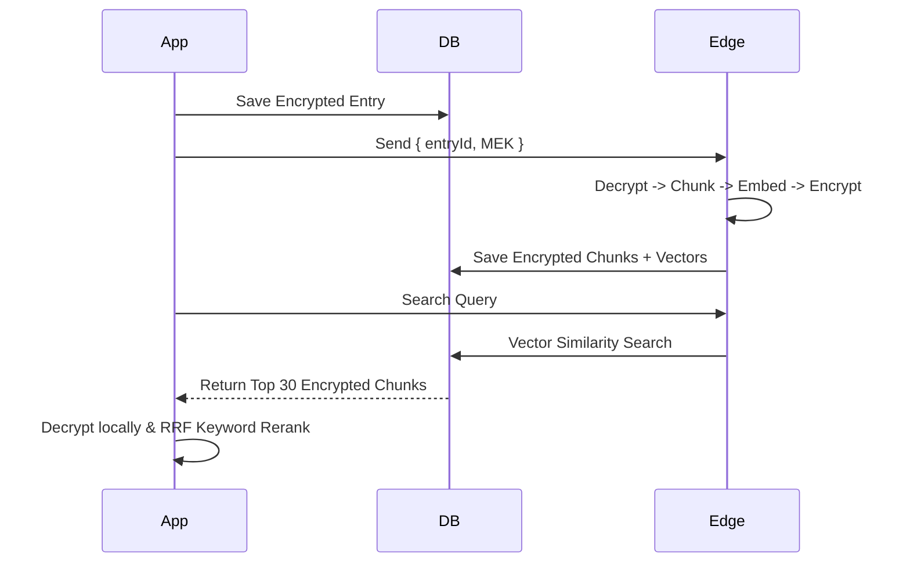

# Qora Architecture Overview

## 1. Account Creation & Auth
- **Frontend**: `app/(auth)/sign-up.tsx`
- **Flow**: Standard email/password via Supabase Auth.
- **Profile Initialization**: First-time login triggers the Recovery flow to generate encryption keys.

## 2. Encryption (E2EE Architecture)
- **MEK (Message Encryption Key)**: AES-256 key used to encrypt/decrypt all journal entries locally.
- **KEK (Key Encryption Key)**: Derived from the user's Recovery Passphrase (PBKDF2). Used strictly to wrap the MEK for remote storage.
- **Storage**: Unwrapped MEK is stored locally (`SecureStore`). Wrapped MEK is stored remotely (`user_encryption_keys` table).
- **Unlock Flow**: User enters passphrase -> derives KEK -> fetches wrapped MEK -> unwraps -> saves locally.

## 3. Entry Processing Pipeline
- **Initial Save**: Client encrypts text with MEK -> saves to `entries` table.
- **Edge Processing (`process-entry`)**: Edge Function receives the entry ID and the **plaintext MEK**, decrypts the text in memory, splits it into chunks, generates vector embeddings (`gte-small`), re-encrypts the chunks, and saves to `entry_chunks`.

## 4. Database Schema
- **`entries`**: Top-level journal data (`encrypted_content`, `entry_type`, status).
- **`entry_chunks`**: Sub-sections of entries for search (`encrypted_chunk_text`, `embedding`).
- **`user_encryption_keys`**: Persists the wrapped MEK and salt.
- **Security**: Standard Row-Level Security (RLS) restricts access to `auth.uid() = user_id`.

## 5. Search Engine
- **Retrieval**: User query and optional date ranges sent to `search-entries` Edge Function -> generates vector -> calls `match_entries` RPC to fetch top 30 conceptually similar encrypted chunks.
- **Local Reranking**: Client decrypts the 30 chunks -> runs exact keyword matching -> combines vector rank + keyword rank using Reciprocal Rank Fusion (RRF) -> displays top 10.

## 6. Bulk Actions & Export Functionality
- **Selection**: Users can long-press or use a "Select All" feature to multi-select journals from search results or filtered date ranges.
- **Context Briefs**: Users can instantly export selected entries as plain-text Context Briefs for sharing with external LLMs or therapists.
- **Bulk Delete**: Users can permanently delete multiple encrypted entries at once from the unified interface.

## 7. Admin Dashboard
- **Scope**: User-scoped task management (`app/(tabs)/admin.tsx`).
- **Functionality**: Retry failed transcriptions or unindexed embeddings. No privileged global access.

## 8. Edge Functions
- **`process-entry`**: Decrypts, chunks, embeds, and re-encrypts text entries.
- **`transcribe`**: Sends raw audio to Groq Whisper API, encrypts resulting text, triggers `process-entry`.
- **`search-entries`**: Converts natural language queries into mathematical vectors.

## 9. Data Flows

### Signup & Unlock

### Create & Search Pipeline

## 10. Privacy Boundaries

| Data Type | Client View | Supabase DB | Edge Functions | Encrypted at rest |
|---|---|---|---|---|
| Passwords/Auth | No | Yes (Hashed) | No | Yes |
| Wrapped MEK | Yes | Yes | No | N/A |
| Plaintext MEK | Yes | No | **Yes (in memory)** | N/A |
| Journal Text | Yes | No | **Yes (in memory)** | Yes (AES-GCM) |
| Audio Files | Yes | **Yes (Plaintext)** | Yes | No |
| Text Embeddings | No | Yes | Yes | No |
| Search Queries | Yes | No | **Yes (Plaintext)** | N/A |

## 11. Local Private AI Model Storage & Inference

Qora features an optional on-device "Deep Analysis" reranker powered by a small local LLM (**Qwen3 0.6B Q4_K_M**). 

### Model Storage & Distribution (Cloudflare R2)
- **Source**: The raw GGUF model is hosted securely in a **Private Cloudflare R2 Bucket** (`ai-models`) to minimize egress costs.
- **Session Management**: Users are strictly limited to **10 successful model installations per month** per account.
- **Download Flow**: 
  - The client hits the `private-ai-download-url` Edge Function.
  - The function verifies the monthly limit, creates a `PENDING`/`DOWNLOADING` session, and issues a temporary signed S3/R2 URL.
  - The client streams the download (to OPFS on Web, or `documentDirectory` on Mobile) and verifies the integrity via SHA-256 and exact byte size.
  - Only upon successful verification does the client trigger `complete-private-ai-download`, making the session `COMPLETED` and incrementing the monthly limit. Failed/canceled/interrupted downloads do not consume the quota.

### Deep Analysis & Privacy
- **Execution**: The model is lazily loaded into RAM only when actively needed.
- **Analysis Pipeline**: The system deduplicates and groups retrieved search chunks by journal, then processes them in small batches through the local Qwen model using a strict instruction prompt. 
- **Output**: The AI generates a `Journal Brief` (a 1-sentence summary of the entry), a `Relevant Part` ("You talked about..."), and a discrete categorical relevance label (`DIRECT`, `RELATED`, `WEAK`, `NOT_RELEVANT`).
- **Privacy**: The Private AI inference happens completely offline. Decrypted journal chunks and prompts are never sent to Cloudflare, Supabase, Hugging Face, or any other AI provider. R2 credentials remain exclusively on the backend.
