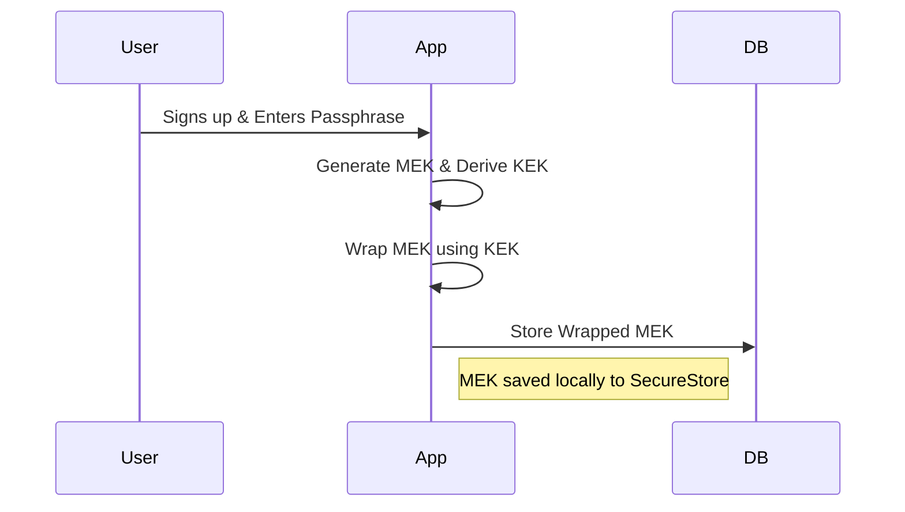
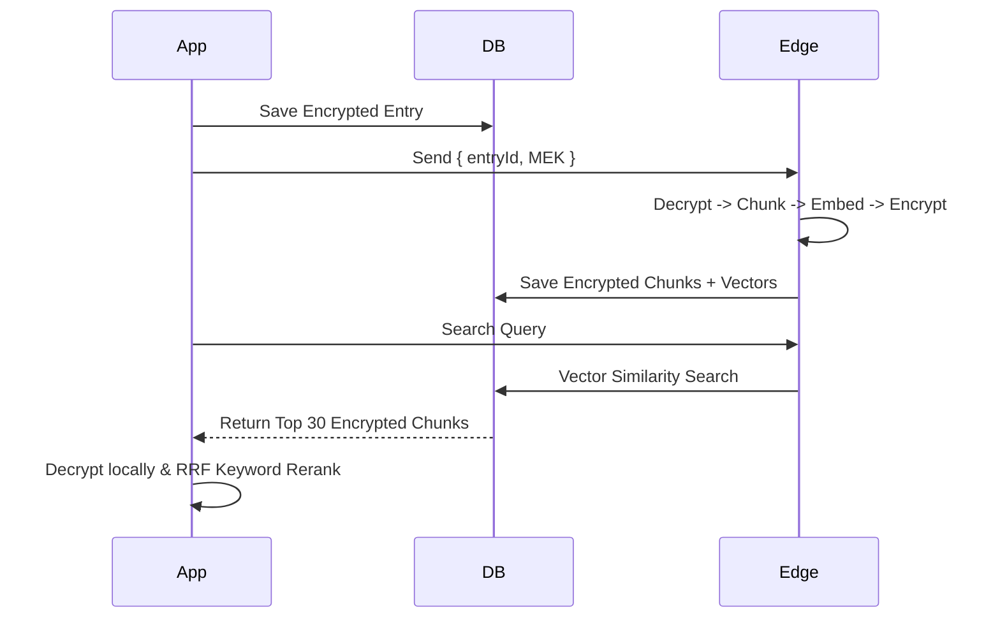
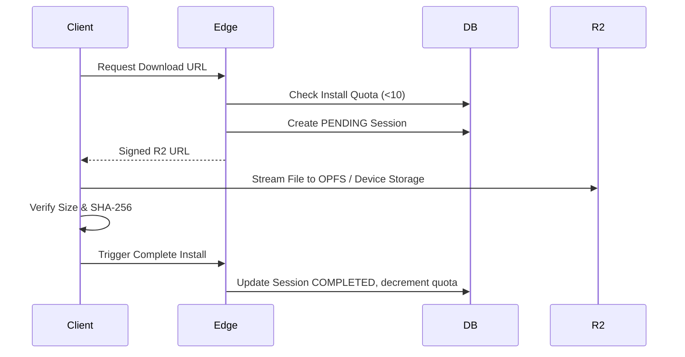
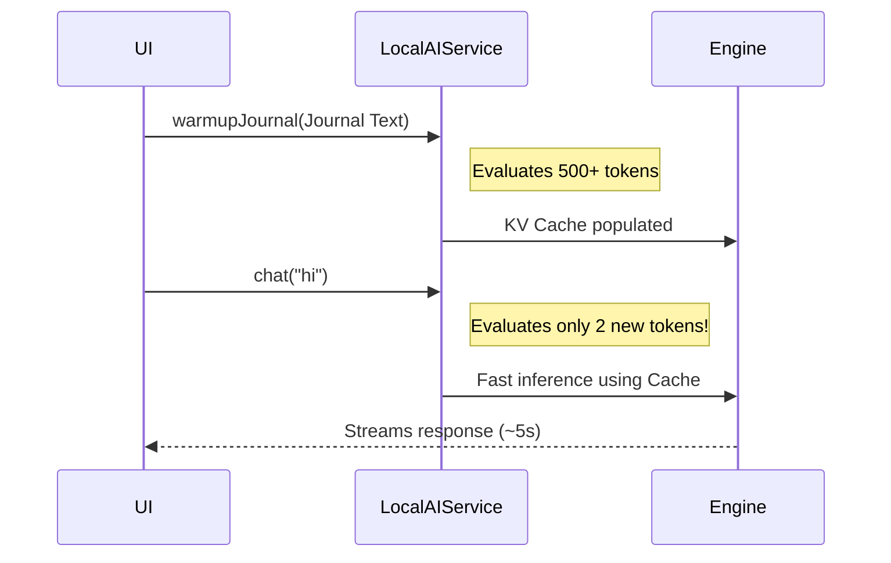

# Qora Architecture Overview

## 1. Account Creation & Auth
- **Frontend**: `app/(auth)/sign-up.tsx`
- **Flow**: Standard email/password via Supabase Auth.
- **Profile Initialization**: First-time login triggers the Recovery flow to generate encryption keys.

## 2. Encryption (E2EE Architecture)
- **MEK (Message Encryption Key)**: AES-256 key used to encrypt/decrypt all journal entries locally.
- **KEK (Key Encryption Key)**: Derived from the user's Recovery Passphrase (PBKDF2). Used strictly to wrap the MEK for remote storage.
- **Storage**: Unwrapped MEK is stored locally (`SecureStore`). Wrapped MEK is stored remotely (`user_encryption_keys` table).
- **Unlock Flow**: User enters passphrase -> derives KEK -> fetches wrapped MEK -> unwraps -> saves locally.

## 3. Entry Processing Pipeline
- **Initial Save**: Client encrypts text with MEK -> saves to `entries` table.
- **Edge Processing (`process-entry`)**: Edge Function receives the entry ID and the **plaintext MEK**, decrypts the text in memory, splits it into chunks, generates vector embeddings (`gte-small`), re-encrypts the chunks, and saves to `entry_chunks`.

## 4. Database Schema
- **`entries`**: Top-level journal data (`encrypted_content`, `entry_type`, status).
- **`entry_chunks`**: Sub-sections of entries for search (`encrypted_chunk_text`, `embedding`).
- **`user_encryption_keys`**: Persists the wrapped MEK and salt.
- **Security**: Standard Row-Level Security (RLS) restricts access to `auth.uid() = user_id`.

## 5. Hybrid Search Engine
- **Retrieval**: User query and optional date ranges sent to `search-entries` Edge Function -> generates vector -> calls `match_entries` RPC to fetch top 30 conceptually similar encrypted chunks.
- **Local Reranking**: Client decrypts the 30 chunks -> runs exact keyword matching -> combines vector rank + keyword rank using Reciprocal Rank Fusion (RRF) -> displays top 10.

## 6. Bulk Actions & Export Functionality
- **Selection**: Users can long-press or use a "Select All" feature to multi-select journals from search results or filtered date ranges.
- **Context Briefs**: Users can instantly export selected entries as plain-text Context Briefs for sharing with external LLMs or therapists.
- **Bulk Delete**: Users can permanently delete multiple encrypted entries at once from the unified interface.

## 7. Admin Dashboard
- **Scope**: User-scoped task management (`app/(tabs)/admin.tsx`).
- **Functionality**: Retry failed transcriptions or unindexed embeddings. No privileged global access.

## 8. Edge Functions
- **`process-entry`**: Decrypts, chunks, embeds, and re-encrypts text entries.
- **`transcribe`**: Sends raw audio to Groq Whisper API, encrypts resulting text, triggers `process-entry`.
- **`search-entries`**: Converts natural language queries into mathematical vectors.

## 9. Data Flows

### Signup & Unlock

### Create & Search Pipeline

## 10. Privacy Boundaries
It is critical to distinguish between the local AI path, current server processing, and the true zero-knowledge target. **The current architecture is NOT fully zero-knowledge.** 

| Data Type | Client View | Supabase DB | Edge Functions | Encrypted at rest |
|---|---|---|---|---|
| Passwords/Auth | No | Yes (Hashed) | No | Yes |
| Wrapped MEK | Yes | Yes | No | N/A |
| Plaintext MEK | Yes | No | **Yes (in memory)** | N/A |
| Journal Text | Yes | No | **Yes (in memory)** | Yes (AES-GCM) |
| Raw Audio Files | Yes | **Yes (Plaintext)** | Yes | No |
| Text Embeddings | No | Yes | Yes | No |
| Search Queries | Yes | No | **Yes (Plaintext)** | N/A |
| **Local AI Chat** | **Yes** | **No** | **No** | **N/A** |

## 11. Local Private AI Model Storage & Distribution
Qora features an on-device "Private AI" Chat powered by a small local LLM. 

### Model Specifications
- **Model**: Qwen3 0.6B Instruct (Q4_K_M GGUF format)
- **Web Runtime**: `@wllama/wllama` using WebGPU and multi-threaded WASM (`src/services/LocalAIService.ts`).
- **Mobile Runtime**: `llama.rn` (native C++ execution path).

### Distribution Logic (Cloudflare R2)
- **Private Bucket**: The raw GGUF model is hosted in a private Cloudflare R2 Bucket.
- **Signed URL**: The client hits `supabase/functions/private-ai-download-url` to verify quotas and issue a temporary signed S3/R2 URL.
- **Storage**: Downloaded to Origin Private File System (OPFS) on Web, or App Private `documentDirectory` on Mobile. Model persists on disk across sessions.
- **Integrity**: Exact file size and SHA-256 verification are required before installing.
- **Quota Management**: Users are strictly limited to **10 successful completed installations per month**. Failed, canceled, or partial downloads do not consume the quota. Only upon successful verification does the client trigger `complete-private-ai-download` (status `COMPLETED`).

### Model Install Flow

## 12. Browser Acceleration & WebGPU
For the local AI to run acceptably on Web, strict browser acceleration is required (`app.json` / Webpack config level).
- **COOP/COEP Headers**: `Cross-Origin-Opener-Policy: same-origin` and `Cross-Origin-Embedder-Policy: require-corp` must be set to enable `crossOriginIsolated = true`.
- **SharedArrayBuffer**: Required for multi-threaded WASM. It will implicitly fail without `crossOriginIsolated` (localhost alone is NOT enough).
- **Execution Strategy**: WebGPU accelerates prompt evaluation (`n_gpu_layers: 50`). Multi-threaded WASM (8 threads) provides the fallback for devices without WebGPU support. 
- **Telemetry Note**: CPU and WebGPU strategies must be explicitly benchmarked per-device; blind assumptions lead to massive performance penalties.

## 13. RAG vs KV Cache vs CAG
Qora relies on different caching paradigms:
- **Local RAG**: The app queries the DB to retrieve top conceptually similar *chunks*, and injects them locally.
- **KV Cache**: An inference optimization where the AI engine evaluates token matrices and stores them in RAM. This allows the model to re-use previous context instantly instead of recalculating math for 500-word journals.
- **CAG (Cache-Augmented Generation)**: The current Private AI Chat behaves like CAG. A fixed context (the journal) is prefetched into the KV cache once and reused for all subsequent follow-up questions.

## 14. Journal Prefill & KV Cache Management
To achieve a 5–8 second response time for short Q&A, the heavy ~25s initialization cost is front-loaded before the user can type.

### Prefill Flow (`src/services/LocalAIService.ts` -> `warmupJournal`)
1. **Model Load**: Model is lazily loaded into RAM (`LocalAIService.initAndDownload`). UI: "LOADING AI..."
2. **Prefill / Cache Warmup**: The system prompt and selected journal text are passed to the engine. The engine tokenizes and mathematically evaluates the journal, caching it in the KV Cache. UI: "READING YOUR JOURNAL..."
3. **Chat Ready**: Once the prefill completes, the chat UI is unlocked. UI: "Ready. Ask anything about it."
4. **Important**: The app strictly waits for the `warmupJournal` promise to resolve. It does not falsely claim "I've read your journal" before prefill finishes.

### Cache Survival & Sequence Matching
For follow-up questions to reuse the cache, the Wllama engine context must physically survive across messages. 
- The exact prompt prefix (System Prompt + Journal + Past History) must perfectly match the string evaluated during prefill. 
- If the prefix changes, `llama.cpp` resets the context and flushes the cache, resulting in a ~40s penalty.
- Cache invalidation only occurs deliberately (changing journals, changing models, compacting context).

### Chat Flow

## 15. Qwen Thinking Mode & Output Constraints
- **Current Implementation**: The model is highly predisposed to output a verbose `<think>` block, adding ~30s of invisible generation time. We currently use a prompt injection hack (`<|im_start|>assistant\n<think>\nI will answer directly.\n</think>\n`) explicitly forced into the history loop to physically trick the model into skipping reasoning. Hidden reasoning is stripped via regex.
- **Output Constraints**: To keep generation times low, responses are instructed to be concise (2-4 sentences) with a hard cap at `max_tokens: 150`.

## 16. Local AI Performance Telemetry
Comprehensive KV cache telemetry is logged in the console during `warmupJournal` and `chat()` for precise debugging:
- **model load ms**: Time to load weights into RAM.
- **journal prefill ms**: Time to evaluate the journal context into KV cache.
- **prompt eval ms**: Fast-path evaluation time for new tokens (should be <2s on warm runs).
- **generation ms**: Time spent generating tokens.
- **total ms**: Total turnaround time.
- **input tokens / cached tokens / newly evaluated tokens / output tokens**: Tracks cache hit rates.
- **prompt tok/s / generation tok/s**: hardware speed metrics.
- **Engine ID & Exact Prefix Matching**: Proves cache survival across turns.

---

## Current Known Limitations
- RAG searches send plaintext queries to edge functions.
- Audio transcriptions currently send raw audio to a 3rd party (Groq).
- DeepSeek/Qwen Distill models stubbornly generate `<think>` blocks requiring prompt injection hacks.
- The 8-thread WASM fallback on mobile browsers is significantly slower than WebGPU.

## Future Zero-Knowledge Target
- **True End-to-End Search**: Implement Fully Homomorphic Encryption (FHE) or Local Vector Generation via ONNX.wasm so plaintext is never evaluated on the edge.
- **Local Whisper Transcription**: Move audio processing entirely on-device.
- **Proper Non-Thinking Mode**: Remove the fake `<think>` injection hack when models natively respect `reasoning_format = none` without performance penalties.

## Performance Checklist
- [x] WebGPU `n_gpu_layers: 50` utilized.
- [x] COOP/COEP headers present and `crossOriginIsolated = true`.
- [x] Journal Prefill successfully isolates initial evaluate lag.
- [x] Exact String Prefix Matching proven to maintain KV cache across chat turns.
- [x] Artificial `<think>` delay stripped.
